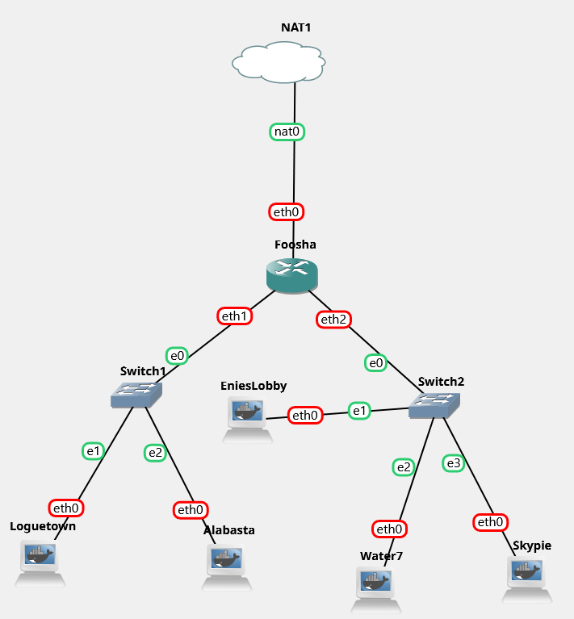

# Jarkom-Modul-2-T14-2021

Anggota Kelompok :
- Dida Prasetyo Rahmat - 05311940000019 
- Revina Rahmanisa Harjanto - 05311940000046 

## 1. EniesLobby akan dijadikan sebagai DNS Master, Water7 akan dijadikan DNS Slave, dan Skypie akan digunakan sebagai Web Server. Terdapat 2 Client yaitu Loguetown, dan Alabasta. Semua node terhubung pada router Foosha, sehingga dapat mengakses internet



### a. Foosha
```
auto eth0
iface eth0 inet dhcp
auto eth1
iface eth1 inet static
	address 192.218.1.1
	netmask 255.255.255.0
auto eth2
iface eth2 inet static
	address 192.218.2.1
	netmask 255.255.255.0
```

### b. Loguetown
```
auto eth0
iface eth0 inet static
	address 192.218.1.2
	netmask 255.255.255.0
	gateway 192.218.1.1
```

### c. Alabasta
```
auto eth0
iface eth0 inet static
	address 192.218.1.3
	netmask 255.255.255.0
	gateway 192.218.1.1
```

### d. EniesLobby
```
auto eth0
iface eth0 inet static
	address 192.218.2.2
	netmask 255.255.255.0
	gateway 192.218.2.1
```

### e. Water7
```
auto eth0
iface eth0 inet static
	address 192.218.2.3
	netmask 255.255.255.0
	gateway 192.218.2.1
```

### f. Skypie
```
auto eth0
iface eth0 inet static
	address 192.218.2.4
	netmask 255.255.255.0
	gateway 192.218.2.1
```


## 2. Luffy ingin menghubungi Franky yang berada di EniesLobby dengan denden mushi. Kalian diminta Luffy untuk membuat website utama dengan mengakses franky.yyy.com dengan alias www.franky.yyy.com pada folder kaizoku

### a. `/etc/bind/named.conf.local` (EniesLobby)
```
$TTL    604800
@       IN      SOA     franky.TI14.com. root.franky.TI14.com. (
                        2021102601      ; Serial
                         604800         ; Refresh
                          86400         ; Retry
                        2419200         ; Expire
                         604800 )       ; Negative Cache TTL
;
@       IN      NS      franky.TI14.com.
@       IN      A       192.218.2.4
www     IN      CNAME   franky.TI14.com.
```

### b. `/etc/bind/named.conf.options` (EniesLobby)
```
zone "franky.TI14.com" {
    type master;
    file "/etc/bind/kaizoku/franky.TI14.com";
};
```

## 3. Setelah itu buat subdomain super.franky.yyy.com dengan alias www.super.franky.yyy.com yang diatur DNS nya di EniesLobby dan mengarah ke Skypie

### a. `/etc/bind/named.conf.local` (EniesLobby)
```
$TTL    604800
@       IN      SOA     franky.TI14.com. root.franky.TI14.com. (
                        2021102601      ; Serial
                         604800         ; Refresh
                          86400         ; Retry
                        2419200         ; Expire
                         604800 )       ; Negative Cache TTL
;
@       IN      NS      franky.TI14.com.
@       IN      A       192.218.2.4
www     IN      CNAME   franky.TI14.com.
super   IN      A       192.218.2.4
www.super       IN      CNAME   super.franky.TI14.com.
```

## 4. Buat juga reverse domain untuk domain utama

### a. `/etc/bind/named.conf.local` (EniesLobby)
```
	...
	zone "2.218.192.in-addr.arpa" {
	    type master;
	    file "/etc/bind/kaizoku/2.218.192.in-addr.arpa";
	};
```

### b. `/etc/bind/kaizoku/2.218.192.in-addr.arpa` (EniesLobby)
```
$TTL    604800
@       IN      SOA     franky.TI14.com. root.franky.TI14.com. (
                        2021102601      ; Serial
                         604800         ; Refresh
                          86400         ; Retry
                        2419200         ; Expire
                         604800 )       ; Negative Cache TTL
;
2.218.192.in-addr.arpa. IN      NS      franky.TI14.com.
2       IN      PTR     franky.TI14.com.
```


## 5. Supaya tetap bisa menghubungi Franky jika server EniesLobby rusak, maka buat Water7 sebagai DNS Slave untuk domain utama

### a. `/etc/bind/named.conf.local` (EniesLobby)
```
zone "franky.TI14.com" {
    type master;
    notify yes;
    also-notify { 192.218.2.3; };
    allow-transfer { 192.218.2.3; };
    file "/etc/bind/kaizoku/franky.TI14.com";
};
...
```

### b. `/etc/bind/named.conf.local` (Water7)
```
zone "franky.TI14.com" {
    type slave;
    masters { 192.218.2.2; };
    file "/var/lib/bind/franky.TI14.com";
};
```

## 6. Setelah itu terdapat subdomain mecha.franky.yyy.com dengan alias www.mecha.franky.yyy.com yang didelegasikan dari EniesLobby ke Water7 dengan IP menuju ke Skypie dalam folder sunnygo

### a. `/etc/bind/kaizoku/franky.TI14.com` (EniesLobby)
```
$TTL    604800
@       IN      SOA     franky.TI14.com. root.franky.TI14.com. (
                        2021102601      ; Serial
                         604800         ; Refresh
                          86400         ; Retry
                        2419200         ; Expire
                         604800 )       ; Negative Cache TTL
;
@       IN      NS      franky.TI14.com.
@       IN      A       192.218.2.4
www     IN      CNAME   franky.TI14.com.
super   IN      A       192.218.2.4
www.super       IN      CNAME   super.franky.TI14.com.
ns1     IN      A       192.218.2.3
mecha   IN      NS      ns1
```

### b. `/etc/bind/named.conf.options` (EniesLobby)
```
options {
    directory "/var/cache/bind";
    // forwarders {
    //      0.0.0.0;
    // };
    //dnssec-validation auto;
    allow-query{any;};
    auth-nxdomain no;    # conform to RFC1035
    listen-on-v6 { any; };
};
```

### c. `/etc/bind/named.conf.local` (EniesLobby)
```
zone "franky.TI14.com" {
    type master;
    notify yes;
    also-notify { 192.218.2.3; };
    allow-transfer { 192.218.2.3; }; //Sudah ada
    file "/etc/bind/kaizoku/franky.TI14.com";
};
```

### d. `/etc/bind/named.conf.options` (Water7)
```
options {
    directory "/var/cache/bind";
    // forwarders {
    //      0.0.0.0;
    // };	    
    //dnssec-validation auto;
    allow-query{any;};
    auth-nxdomain no;    # conform to RFC1035
    listen-on-v6 { any; };
```

### e. `/etc/bind/named.conf.local` (Water7)
```
zone "franky.TI14.com" {
    type slave;
    masters { 192.218.2.2; };
    file "/var/lib/bind/franky.TI14.com";
};
```

### f. `/etc/bind/sunnygo/mecha.franky.TI14.com` (Water7)
```
$TTL    604800
@       IN      SOA     mecha.franky.TI14.com. root.mecha.franky.TI14.com. (
                        2021102601      ; Serial
                         604800         ; Refresh
                          86400         ; Retry
                        2419200         ; Expire
                         604800 )       ; Negative Cache TTL
;
@       IN      NS      mecha.franky.TI14.com.
@       IN      A       192.218.2.4
www     IN      CNAME   mecha.franky.TI14.com.
```

## 7. Untuk memperlancar komunikasi Luffy dan rekannya, dibuatkan subdomain melalui Water7 dengan nama general.mecha.franky.yyy.com dengan alias www.general.mecha.franky.yyy.com yang mengarah ke Skypie

### a. `/etc/bind/sunnygo/mecha.franky.TI14.com` (water7)
```
$TTL    604800
@       IN      SOA     mecha.franky.TI14.com. root.mecha.franky.TI14.com. (
                        2021102601      ; Serial
                         604800         ; Refresh
                          86400         ; Retry
                        2419200         ; Expire
                         604800 )       ; Negative Cache TTL
;
@       IN      NS      mecha.franky.TI14.com.
@       IN      A       192.218.2.4
www     IN      CNAME   mecha.franky.TI14.com.
general IN      A       192.218.2.4
www.general     IN      CNAME   general.mecha.franky.TI14.com.
```

## 8. Setelah melakukan konfigurasi server, maka dilakukan konfigurasi Webserver. Pertama dengan webserver www.franky.yyy.com. Pertama, luffy membutuhkan webserver dengan DocumentRoot pada /var/www/franky.yyy.com.

### a. `/etc/apache2/sites-available/franky.TI14.com.conf` (Skypie)
```
<VirtualHost *:80>
    ServerAdmin webmaster@localhost
    ServerName franky.TI14.com
    ServerAlias www.franky.TI14.com
    DocumentRoot /var/www/franky.TI14.com
    ErrorLog ${APACHE_LOG_DIR}/error.log
    CustomLog ${APACHE_LOG_DIR}/access.log combined
</VirtualHost>
```

## 9. Setelah itu, Luffy juga membutuhkan agar url www.franky.yyy.com/index.php/home dapat menjadi menjadi www.franky.yyy.com/home

### a. `/etc/apache2/sites-available/franky.TI14.com.conf` (Skypie)
```
<VirtualHost *:80>
    ServerAdmin webmaster@localhost
    ServerName franky.TI14.com
    ServerAlias www.franky.TI14.com
    DocumentRoot /var/www/franky.TI14.com
    Alias "/home" "/var/www/franky.TI14.com/index.php"
    ErrorLog ${APACHE_LOG_DIR}/error.log
    CustomLog ${APACHE_LOG_DIR}/access.log combined
</VirtualHost>
```
